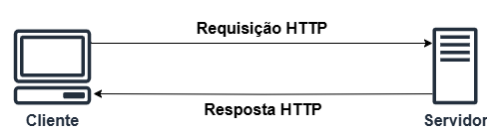

# API 

**API (Interface de Programação de Aplicações)** é um conjunto de regras que permite que diferentes sistemas se comuniquem. Nessa seção serão apresentados os conceitos do protocolo **HTTP** e arquitetura **REST**, que são fundamentais para o desenvolvimento e consumo de APIs modernas. 

O protocolo **HTTP**, ou **Hypertext Transfer Protocol**, é a base de comunicação da web, permitindo a transferência de dados entre clientes e servidores. Já a arquitetura REST (**Representational State Transfer**) é um tipo de arquitetura que utiliza o **HTTP** como protocolo de comunicação.  

## Protocolo HTTP 

O **HTTP** é um protocolo de comunicação utilizado para transferir dados na web. Ele é a base da comunicação entre navegadores (clientes) e servidores na Internet. Sempre que você acessa um site, seu navegador utiliza HTTP para enviar uma requisição ao servidor e receber a resposta.



Observando a figura, podemos entender como a arquitetura HTTP funciona: 

- Cliente faz uma requisição HTTP: 
    - Por exemplo, quando você digita uma URL no navegador, ele faz uma solicitação HTTP ao servidor correspondente; 
    - A requisição especifica o tipo de ação que o cliente quer realizar (ex.: obter um recurso, enviar dados, etc.). 

- Servidor responde: 
   - O servidor processa a solicitação e retorna uma resposta com o recurso solicitado (como uma página HTML, um arquivo JSON, etc.) ou uma mensagem de erro, caso algo dê errado. 

De acordo com o livro *HTTP: The Definitive Guide*, o protocolo HTTP possui as seguintes características: 

1. **Comunicação Cliente-Servidor**: como já evidenciado, o HTTP é baseado em um **modelo cliente-servidor**. O cliente, geralmente um navegador, envia solicitações ao servidor, que responde com os recursos solicitados. 

2. **Conexões Stateless**: Cada requisição HTTP é independente, ou seja, o protocolo não guarda informações sobre requisições anteriores. Isso o torna simples e escalável. 

3. **Métodos HTTP**: Esse protocolo define métodos como: 
    - **GET**: Para recuperar dados; 
    - **POST**: Para enviar dados ao servidor; 
    - **PUT**: Para atualizar ou criar dados; 
    - **DELETE**: Para remover dados; 
    - **HEAD**: Para obter apenas os cabeçalhos da resposta. 

4. **Mensagens HTTP**: As comunicações consistem em mensagens: 
    - Request (solicitação): Enviada pelo cliente ao servidor; 
    - Response (resposta): Retornada pelo servidor ao cliente; 
    - Ambas possuem cabeçalhos e, opcionalmente, um corpo com dados. 

5. **Endereçamento por URIs**: Cada recurso na web é identificado por um Uniform Resource Identifier (URI), como uma URL. 

6. **Códigos de Status**: As respostas incluem códigos que indicam o resultado da solicitação como (em seções a seguir serão explorados mais tipos de códigos de status de execução de APIs com protocolo HTTP): 
    - 200: Sucesso; 
    - 404: Recurso não encontrado; 
    - 500: Erro no servidor. 

7. **Uso do TCP/IP**: HTTP depende do protocolo TCP para comunicação confiável. 

8. **Extensibilidade**: É possível adicionar cabeçalhos e funcionalidades ao protocolo sem quebrar a compatibilidade. 

Essas características tornam o protocolo HTTP flexível e amplamente utilizado como o principal protocolo para a web moderna. 

## Arquitetura REST 

**REST** é um tipo de arquitetura de software desenvolvido para sistemas distribuídos, principalmente para web. Esse conceito foi apresentado em 2000 por Roy Fielding, em sua tese de doutorado chamada *Architectural Styles and the Design of Network-based Software Architectures*, na Universidade da Califórnia. 

Roy Fielding é um cientista da computação que, junto de outros pesquisadores, ajudou a escrever a especificação do protocolo HTTP. Na tese dele, o REST é descrito como um conjunto de restrições arquiteturais que, quando aplicadas a um sistema, ajudam a criar uma arquitetura mais escalável, eficiente e confiável. A ideia principal é tratar tudo como um recurso, que pode ser representado e manipulado por uma interface padrão, usando os métodos do HTTP, tipo GET, POST, PUT e DELETE. 

A arquitetura REST foi pensada pelo Roy para resolver problemas de complexidade, falta de padronização e dificuldade de escalabilidade na comunicação entre sistemas distribuídos. Antes da REST, as integrações eram frequentemente baseadas em protocolos proprietários ou soluções pesadas, dificultando a interoperabilidade e a evolução dos sistemas. A REST surgiu como uma solução simples e flexível, utilizando o HTTP como base e estabelecendo princípios claros, como identificação de recursos por URIs, interface uniforme e comunicação sem estado, permitindo maior eficiência e escalabilidade na web. 

Um exemplo prático de como  a REST melhorou a comunicação na web é o caso das APIs de serviços de mapas, como o Google Maps. Antes da REST, integrar serviços de mapas em uma aplicação exigia protocolos complexos, arquivos grandes de dados geográficos ou software específico instalado no cliente. Isso tornava o processo lento e dependente de soluções proprietárias. 

Com a REST, o Google Maps disponibiliza uma API onde cada recurso (como um mapa, rota ou ponto de interesse) é acessado por uma URI. Por exemplo, para obter informações sobre a rota entre dois endereços, basta fazer uma requisição HTTP como a seguir: 

```bash 
GET https://maps.googleapis.com/maps/api/directions/json?origin=São+Paulo&destination=Rio+de+Janeiro 
``` 

A resposta vem em formato JSON, padronizado e fácil de manipular, contendo as informações da rota:  

```bash 
{ 
  "geocoded_waypoints": [ 
    { 
      "geocoder_status": "OK", 
      "place_id": "ChIJd7zN_thzj5QRFEWG1k9gJ08", 
      "types": ["locality", "political"] 
    }, 
    { 
      "geocoder_status": "OK", 
      "place_id": "ChIJW-T2Wt7_oQAR7zcnxwYQYmU", 
      "types": ["locality", "political"] 
    } 
  ], 
  "routes": [ 
    { 
      "bounds": { 
        "northeast": { 
          "lat": -21.2032, 
          "lng": -41.7388 
        }, 
        "southwest": { 
          "lat": -23.5505, 
          "lng": -46.6333 
        } 
      }, 
      "legs": [ 
        { 
          "distance": { 
            "text": "429 km", 
            "value": 429000 
          }, 
          "duration": { 
            "text": "5 hours 42 mins", 
            "value": 20520 
          }, 
          "start_address": "São Paulo, SP, Brazil", 
          "end_address": "Rio de Janeiro, RJ, Brazil", 
          "start_location": { 
            "lat": -23.5505, 
            "lng": -46.6333 
          }, 
          "end_location": { 
            "lat": -22.9068, 
            "lng": -43.1729 
          }, 
          "steps": [ 
            { 
              "distance": { 
                "text": "3.4 km", 
                "value": 3400 
              }, 
              "duration": { 
                "text": "5 mins", 
                "value": 300 
              }, 
              "html_instructions": "Head northwest on Avenida Paulista", 
              "start_location": { 
                "lat": -23.5505, 
                "lng": -46.6333 
              }, 
              "end_location": { 
                "lat": -23.5478, 
                "lng": -46.6286 
              }, 
              "travel_mode": "DRIVING" 
            }, 
            // Outros passos omitidos para simplificação 
          ] 
        } 
      ], 
      "overview_polyline": { 
        "points": "encodedPolylineString" 
      }, 
      "summary": "BR-116" 
    } 
  ], 
  "status": "OK" 
} 
```

Esse formato de resposta simplifica a integração, permite que qualquer linguagem ou plataforma com suporte a HTTP consuma o serviço e melhora a experiência do desenvolvedor e do usuário final. 

## O que é Flask? 

Flask (https://flask.palletsprojects.com/en/stable/) é uma biblioteca em Python que facilita o desenvolvimento de APIs REST. Ele fornece o essencial para o desenvolvimento de APIs, permitindo flexibilidade para adicionar bibliotecas conforme a necessidade do projeto. 

A biblioteca Flask é simples sendo ideal para iniciantes, é flexível pois permite controlar quais funcionalidades serão adicionadas, e possui ampla adesão da comunidade, com forte suporte e boa documentação. 

 
